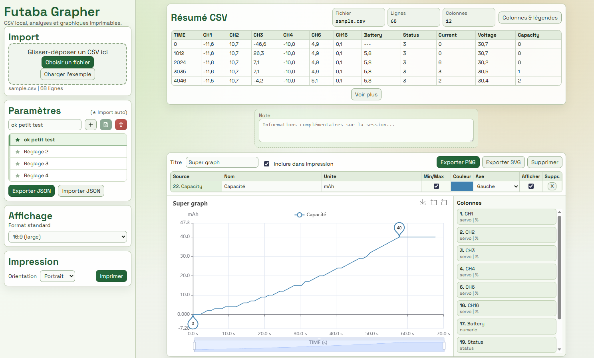

# Futaba Grapher

Futaba Grapher est une application web locale pour analyser des fichiers CSV de télémétrie Futaba et générer des graphiques imprimables.



## Fonctionnalités

-   Import CSV par glisser‑déposer ou sélection de fichier
-   Génération de graphiques multi‑courbes
-   Réglages (paramètres) sauvegardés en localStorage
-   Export/Import des réglages en JSON
-   Impression avec mise en page optimisée (A4)
-   Marqueurs Min/Max optionnels

## Utilisation

### Accès en ligne (GitHub Pages)

```
https://jrmlg.github.io/FutabaGrapher/
```

1. Ouvrir le lien dans un navigateur.
2. Importer un CSV.
3. Ajouter un graphique, puis glisser des colonnes dans le graphique.
4. Ajuster les options (axes, couleurs, min/max, etc.).
5. Imprimer via le bouton **Imprimer**.

### Réglages (Paramètres)

-   Créer un réglage avec **+**.
-   Renommer le réglage via le champ de nom.
-   Sauvegarder l’état courant via **Mettre à jour**.
-   Supprimer via la corbeille.
-   Définir le réglage par défaut en cliquant sur l’étoile.
-   Exporter/Importer les réglages en JSON via les boutons en bas du bloc.

## Format CSV attendu

Le CSV doit respecter les en‑têtes de la ligne 3 (A3 → W3), identiques aux fichiers d’exemple :

```
TIME;CH1;CH2;CH3;CH4;CH5;CH6;CH7;CH8;CH9;CH10;CH11;CH12;CH13;CH14;CH15;CH16;BATTERY;EXTERNAL BATTERY;STATUS;CURRENT;VOLTAGE;CAPACITY;
```

Si les en‑têtes ne correspondent pas, l’import est refusé.

## Exemple

Le bouton **Charger l’exemple** charge :

-   `public/sample.csv`

## Crédit

Projet réalisé par **Jérôme LEGO**.
